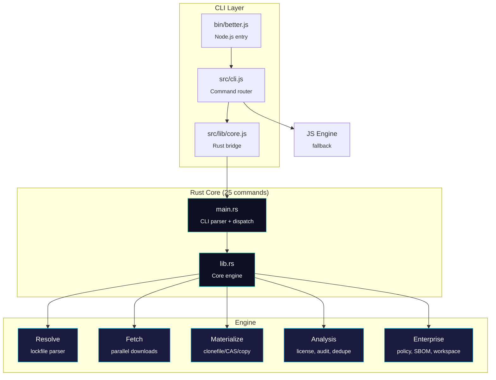

<p align="center">
  
</p>

<p align="center">
  <a href="#performance"></a>
  <a href="#performance"></a>
  
  
  
  
</p>

<p align="center">
  <b>A faster, smarter package manager for Node.js — built on a pure Rust core.</b>
</p>

---

## Performance

Benchmarked on a real project with 15 dependencies (145 resolved packages):

<table>
<tr><th>Tool</th><th align="right">Warm Install</th><th align="right">Cold Install</th><th align="right">vs better</th></tr>
<tr><td><b>better</b></td><td align="right"><b>75ms</b></td><td align="right">~400ms</td><td align="right">-</td></tr>
<tr><td>bun</td><td align="right">198ms</td><td align="right">~500ms</td><td align="right">2.6x slower</td></tr>
<tr><td>npm</td><td align="right">1,749ms</td><td align="right">~8,000ms</td><td align="right">23x slower</td></tr>
</table>

<details>
<summary><b>How it works</b></summary>
<br>

| Layer | Technique | Impact |
|-------|-----------|--------|
| **Binary** | Pure Rust — zero Node.js startup | saves ~265ms vs JS tools |
| **I/O** | macOS `clonefile()` — APFS copy-on-write | near-instant materialization |
| **Concurrency** | rayon-powered parallel everything | resolution, fetch, extract, link |
| **Storage** | SHA-512 package cache + SHA-256 file CAS | dedup across projects |
| **Fallback** | 3-tier: clonefile > CAS hardlinks > copy | works on all filesystems |

</details>

<details>
<summary><b>Cross-project dedup (<code>--dedup</code>)</b></summary>
<br>

Share `node_modules` files across projects via hardlinks from a global store:

```bash
better install --dedup
```

| Projects | Without dedup | With --dedup | Savings |
|----------|-------------:|-------------:|--------:|
| 2 | 28MB | ~16MB | **43%** |
| 5 | 70MB | ~18MB | **74%** |
| 10 | 140MB | ~20MB | **86%** |

Files share the same inode — editing one won't affect others (copy-on-write at the filesystem level).

</details>

---

## Install

```bash
# Build the Rust core
cd crates && cargo build --release -p better-core

# Use directly
./crates/target/release/better-core install --project-root /path/to/project

# Or via Node.js CLI (auto-detects Rust binary)
node bin/better.js install
```

---

## Commands

### Install & Analyze

```bash
better install                  # Install dependencies (auto-selects fastest strategy)
better install --dedup          # Install with cross-project file dedup
better install --no-scripts     # Skip lifecycle scripts
better analyze                  # Dependency attribution, duplicates, depth analysis
better scan                     # Low-level lockfile scan
```

### Script Runner

```bash
better run <script>             # Run package.json scripts (node_modules/.bin on PATH)
better run lint test build      # Run multiple scripts in parallel
better run dev --watch          # Run with file watching (auto-restart on changes)
better test                     # Alias: better run test
better lint                     # Alias: better run lint
better dev                      # Alias: better run dev (watch mode by default)
better build                    # Alias: better run build
better start                    # Alias: better run start
```

> Scripts automatically load `.env` and `.env.local` files from the project root.

### Dependency Intelligence

```bash
better why <package>            # Trace why a package is installed (dependency paths)
better outdated                 # Check for newer versions on npm registry
better dedupe                   # Detect duplicate packages with dedup analysis
better license                  # Scan all package licenses
better license --allow MIT,ISC  # Allow only specific licenses
better license --deny GPL-3.0   # Deny specific licenses
better audit                    # Security vulnerability scan via OSV.dev
better audit --min-severity high # Filter by severity
```

<details>
<summary><b>Health & Diagnostics</b></summary>
<br>

```bash
better doctor                   # Health score (0-100) with actionable findings
better doctor --threshold 80    # Fail if score below threshold
better benchmark                # Comparative install timing across package managers
better benchmark --rounds 5     # Number of benchmark rounds
better benchmark --pm npm,bun   # Select package managers to compare
better env                      # Show Node.js version, platform, project info
better env check                # Validate engines constraints from package.json
```

</details>

<details>
<summary><b>Cache Management</b></summary>
<br>

```bash
better cache stats              # Cache size, package count, storage breakdown
better cache gc                 # Garbage collect old entries
better cache gc --max-age 30    # Remove entries older than N days
better cache gc --dry-run       # Preview what would be removed
```

</details>

---

### Enterprise Features

#### Script Sandboxing

Control which packages can run lifecycle scripts (`preinstall`, `install`, `postinstall`, `prepare`):

```bash
better scripts scan             # Scan node_modules for lifecycle scripts
better scripts allow <package>  # Whitelist a package
better scripts block <package>  # Blacklist a package
```

Policy stored in `.better-scripts.json` — configure trusted scopes, allowed/blocked packages, and permitted script types.

#### Policy Engine

Automated dependency health scoring with configurable rules:

```bash
better policy check             # Run rules → score 0-100
better policy init              # Generate .betterrc.json with defaults
```

| Rule | Default | Severity |
|------|---------|----------|
| `no-deprecated` | enabled | warning (-5) |
| `max-duplicates` | 3 instances | warning (-5) |
| `max-depth` | 15 levels | warning (-5) |

Fails CI if score < threshold (default: 70). Supports waivers per-package.

#### Lock Fingerprint

Deterministic lockfile verification for CI:

```bash
better lock generate            # Hash lockfile + platform → better.lock.json
better lock verify              # Verify nothing changed (exit 1 on drift)
```

Cache key = `SHA-256(lockfile_hash + platform + arch + node_major)`.

#### Workspace Support

Monorepo-native with topological ordering:

```bash
better workspace list           # List packages with inter-dependencies
better workspace graph          # Topological sort + parallelizable levels
better workspace changed --since HEAD~1  # Git-aware change detection
better workspace run "npm test" # Execute in dependency order
```

Reads `package.json#workspaces` globs. Uses Kahn's algorithm with cycle detection.

#### SBOM Export

Software Bill of Materials for supply chain compliance:

```bash
better sbom                     # CycloneDX 1.5 JSON (default)
better sbom --format spdx       # SPDX 2.3 JSON
```

Includes PURL identifiers (`pkg:npm/name@version`), license data, and integrity hashes.

#### Private Registry Support

Zero-config `.npmrc` integration:

```
# .npmrc
@myorg:registry=https://npm.myorg.com/
//npm.myorg.com/:_authToken=${NPM_TOKEN}
```

Automatically detected during `better install` — scoped registries, auth tokens, and `NPM_CONFIG_REGISTRY` env var.

---

<details>
<summary><b>Developer Tools</b></summary>
<br>

```bash
better hooks install            # Install git hooks (from package.json#better.hooks)
better exec <script.ts>         # Run TS/JS (tsx > esbuild-runner > swc-node > ts-node > node)
better init                     # Initialize a new project
better init --template react    # Scaffold React + Vite + TypeScript
better init --template next     # Scaffold Next.js + TypeScript
better init --template express  # Scaffold Express + TypeScript
```

**Git Hooks** — configure in `package.json`:

```json
{
  "better": {
    "hooks": {
      "pre-commit": "better-core run lint",
      "pre-push": "better-core run test",
      "commit-msg": "conventional-commit"
    }
  }
}
```

</details>

### Aliases

| Alias | Expands to |
|-------|-----------|
| `better i` | `better install` |
| `better t` | `better run test` |
| `better x` | `better exec` |
| `better ws` | `better workspace` |
| `better dedup` | `better dedupe` |
| `better bench` | `better benchmark` |

> All commands output structured JSON for piping and automation.

---

## Architecture



```
crates/
  better-core/              Pure Rust binary
    src/lib.rs               Core library (resolve, fetch, materialize, CAS, bin links,
                             license scan, audit, outdated, doctor, benchmark,
                             scripts policy, workspace, SBOM, lock fingerprint, ...)
    src/main.rs              CLI binary (25 commands + aliases, watch mode, templates)
  better-napi/              Node.js native addon (NAPI bridge)
apps/
  landing/                  Next.js landing page
```

---

## Development

```bash
# Build Rust core
cd crates && cargo build --release -p better-core

# Run tests
node --test test/better-engine.test.js

# Lint & format
npm run lint
npm run format:check
```

---

<p align="center">
  <sub>MIT License</sub>
</p>
